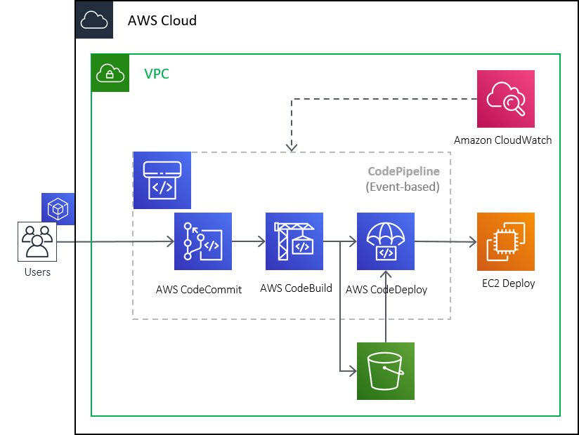

# aws-pipeline-demo
Demo for pipeline automation on the AWS


### Architecture



### Workflow


## Usage

### Linux

```
git clone https://github.com/Rahu2000/aws-pipeline-demo.git
cd aws-pipeline-demo/template/awscli
chmod +x *
./setup_pipeline.sh
```

### OS X

```
brew install gnu-sed
alias sed=gsed

git clone https://github.com/Rahu2000/aws-pipeline-demo.git
cd aws-pipeline-demo/template/awscli
chmod +x *
./setup_pipeline.sh
```
